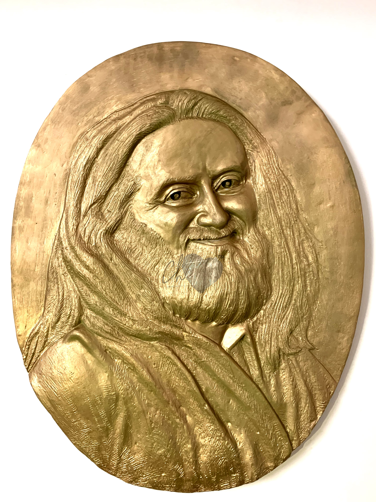

# Sri Sri Ravi Shankar

> Love is not an emotion. It is your very existence!
>
> -- Sri Sri Ravi Shankar

Ravi Shankar is an Indian yoga guru, a spiritual leader. He is frequently referred to as "Sri Sri", Guru ji, or Gurudev

## Thoughts

According to him, science and spirituality are linked and compatible, both springing from the urge to know. The question, "Who am I?" leads to spirituality; the question, "What is this?" leads to science. Emphasizing that joy is only available in the present moment, his stated vision is to create a world free of stress and violence.

## Since 1970

From around the mid 1970s, he worked as an apprentice under Mahesh Yogi, the founder of Transcendental Meditation.

His programs are said to offer practical tools to help accomplish this. He sees breath as the link between body and mind, and a tool to relax the mind, emphasising the importance of both meditation/spiritual practice and service to others.

